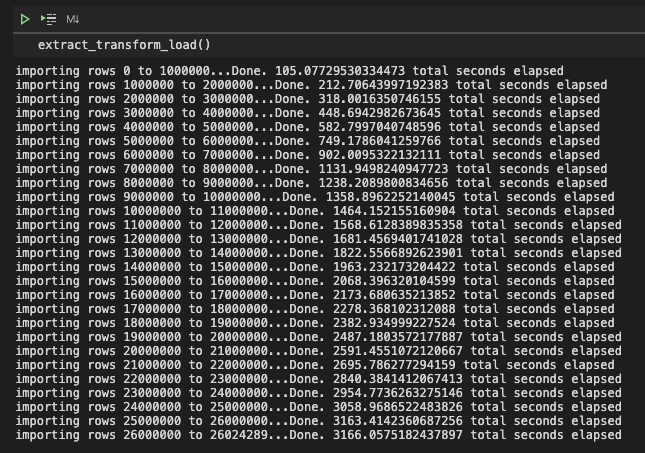
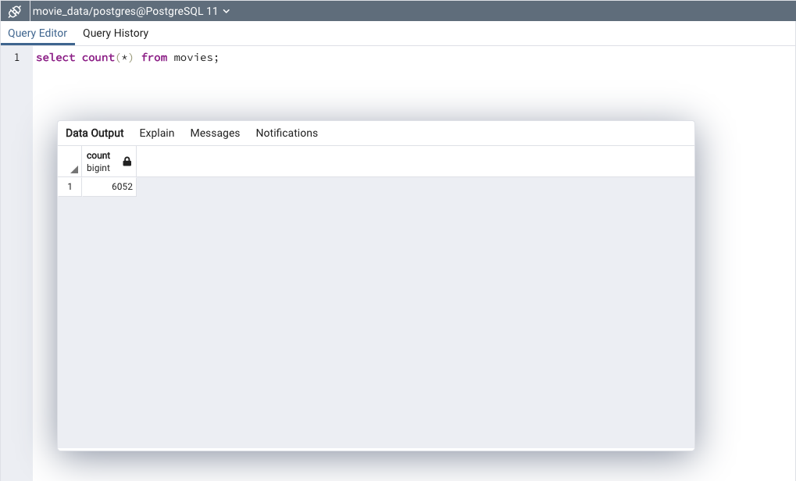
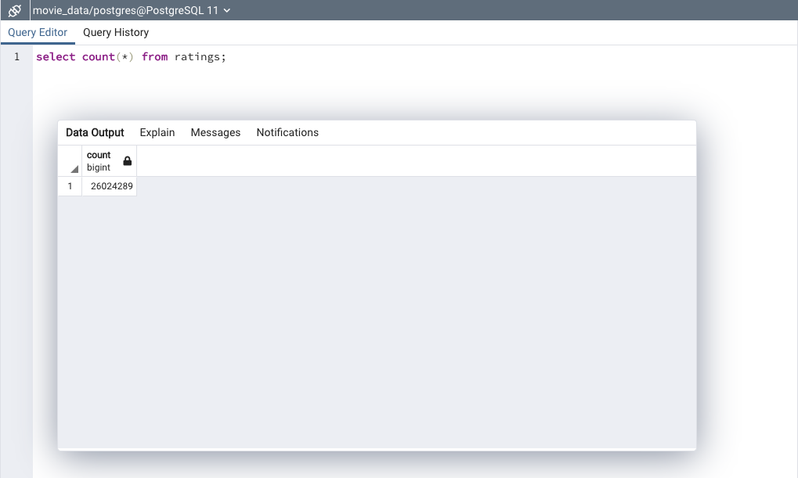

# Movies-ETL
## Overview of the Analysis
The Amazing Prime team would like to create an algorithm that would tell them which low budget video being released will become popular so that they can buy the streaming rights at a bargain.  Amazing Prime decided to sponsored a Hackathon that would allow teams of coders to compete by predicting the popular movies.  In order to allow the coding teams to preform their analysis, we need to help the Amazing Prime team by providing a clean data set of movies.  The source of the movies titles since 1990 comes from Wikipedia and the ratings data comes from the MovieLens website.  In order to provide a useful dataset to the teams we needed to extract the movie data from the two websites, transform the data into one clean dataset and load the dataset into a SQL table so that it can be used at the Amazing Prime team’s Hackathon.

Once we completed our extract, transform and load of the movies data for the Amazing Prime Hackathon, Amazing Prime loved the dataset and wanted to keep the dataset updated on a daily basis.  We accomplished this by refactoring the previous code and creating an automated pipeline that takes in new data, performs the appropriate transformations, and loads the data into existing tables.  The data was sourced from Wikipedia movie data, Kaggle movie metadata and the MovieLens movie rating data and ultimately added to a PostgreSQL database for the Amazing Prime team to reference.

